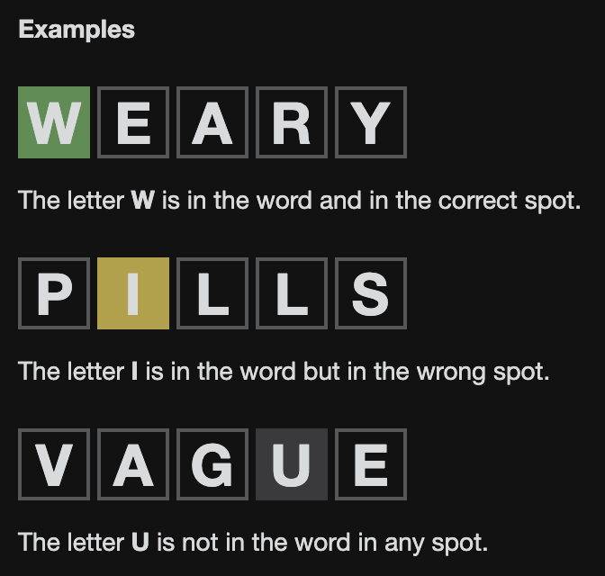
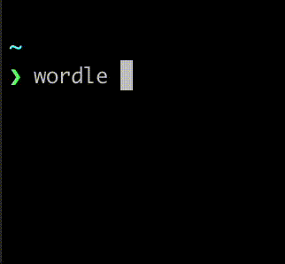

# wordle in your terminal

[](https://crates.io/crates/cl-wordle)
[](https://docs.rs/cl-wordle/latest/cl_wordle/)

## Wordle

[Wordle](https://www.powerlanguage.co.uk/wordle/) is a word guessing game.
Each day you have to guess a new word.
You have 6 attempts and each attempt you make reveals some information.



## Usage

```sh
# play the daily wordle game
wordle

# play the given day (eg if you missed a day)
wordle day <day-number>

# play the given date
wordle date <year-month-day>

# play a random game
wordle random

# play a custom word
wordle custom <word>
```

## Install

```sh
cargo install cl-wordle --locked
```

## Demo


